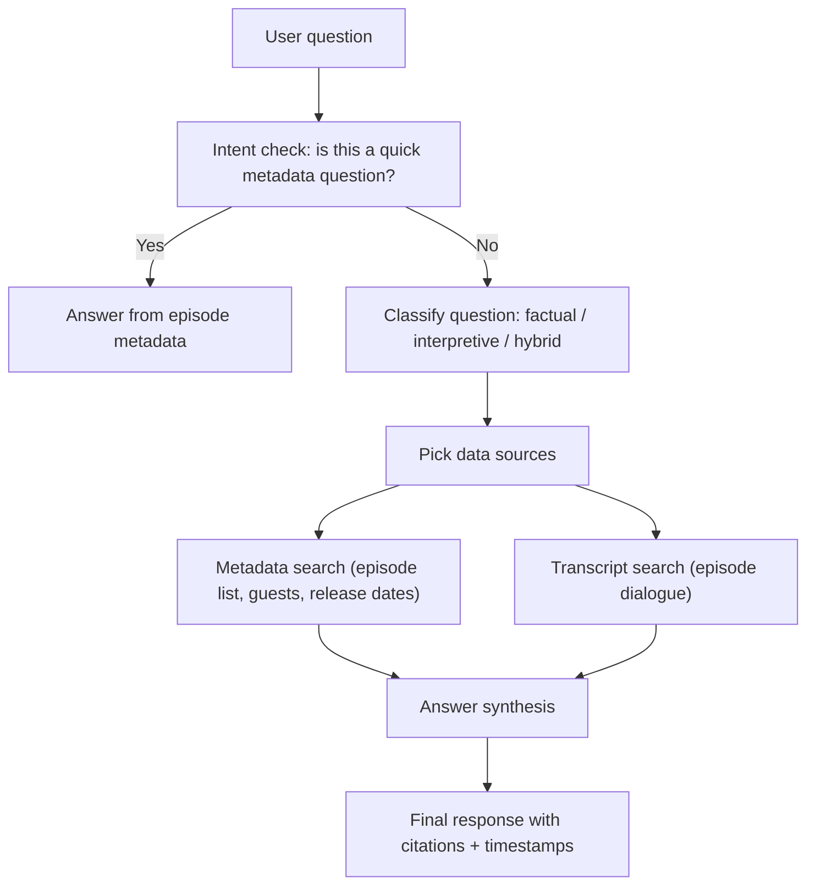
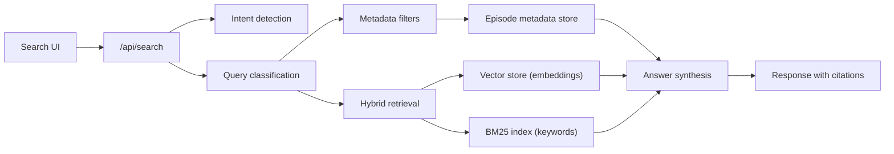

# How a Query Travels Through the Search System

This document explains, in plain language, what happens after someone types a question into the search box. It focuses on **how the question is interpreted**, **which data sources are consulted**, and **how the final answer is assembled**.

## The short version

1. **We check for “simple” questions first.** If it’s something like “latest episode” or “how many episodes,” we answer directly from the episode metadata.
2. **We classify the question.** Is it asking for facts, interpretation, or both?
3. **We search the right data sources.** That can be episode metadata, transcripts, or both.
4. **We assemble a response.** The system writes an answer and includes citations and timestamps.

---

## A simple diagram

## Technical components (high level)

---

## Step‑by‑step explanation

### 1) Intent check (quick answers)
Some questions are **really just metadata lookups**, like:
- “What’s the latest episode?”
- “How many episodes are there?”
- “What’s the latest episode with guest X?”

For these, the system **skips the heavier search** and answers directly from episode metadata (titles, guests, release dates, etc.). This is fast and avoids over‑complication.

---

### 2) Classification: What kind of question is it?
If it’s not a quick metadata lookup, the system classifies the question into one of three buckets:

- **Factual** — “Which episode covered *The Thing*?”
- **Interpretive** — “What did they think about *The Thing*?”
- **Hybrid** — “Which episode covered *The Thing*, and what did they say?”

At the same time, the system extracts **filters** like:
guest, film, director, actor, genre, decade, season.

These filters help narrow down the search to the most relevant episodes.

---

### 3) Data sources consulted

There are two main sources of truth:

#### A) Episode metadata
This is the structured data about each episode:
- Title, guest, release date, season, episode number
- Notable moments, reviewer notes, and other summaries (when available)

If the question is factual or hybrid, metadata is searched first using the extracted filters.

#### B) Transcript search
When we need **what was actually said**, we search the transcripts.

This is done in two ways:
- **Semantic search** (meaning-based, using embeddings)
- **Keyword search** (exact words, using a BM25 index)

These two are combined into a “hybrid” search so we don’t miss relevant passages.

---

### 4) Answer synthesis
Once relevant metadata and transcript passages are gathered, the system **writes a response** in natural language.

It also includes:
- **Citations** to the transcript snippets
- **Timestamps** so you can jump to the right part of the episode

If the search found no strong matches, it will say so rather than guessing.

---

## Why this design works for humans

- **Fast for simple questions** (no need to run a big search)
- **Flexible for open‑ended questions**
- **Grounded in real quotes** (citations + timestamps)
- **Avoids over‑confidence** by refusing to hallucinate when filters don’t match

---

## Quick example

> **Question:** “What did the hosts think about *Alien*?”

1. Intent check → not a simple metadata question  
2. Classification → interpretive  
3. Data sources → transcripts (hybrid search)  
4. Answer → summary + cited quotes + timestamps

---

If you’d like, I can add a second diagram that shows the technical components (API routes, indexing, and LLM calls) without going too deep into code.
