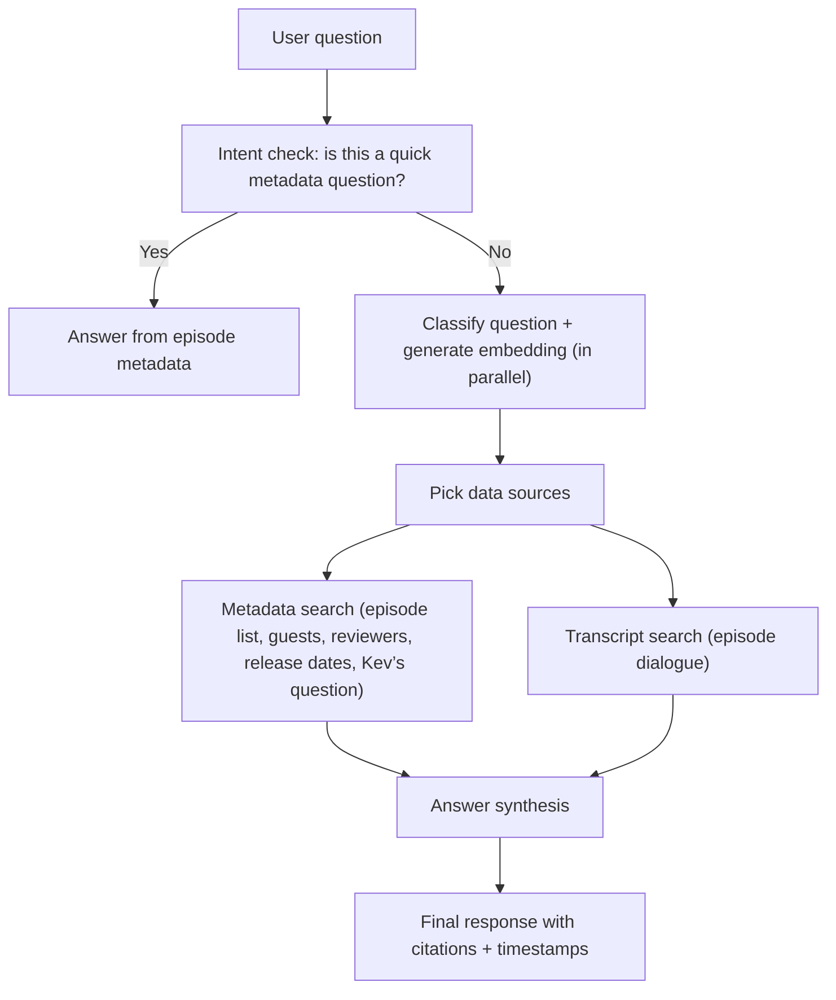
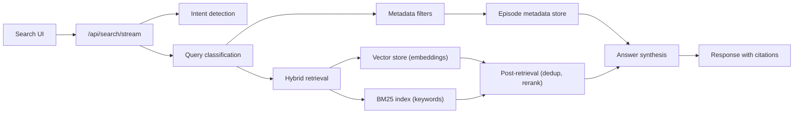

# How a Query Travels Through the Search System

This document explains, in plain language, what happens after someone types a question into the search box. It focuses on **how the question is interpreted**, **which data sources are consulted**, and **how the final answer is assembled**.

## The short version

1. **We check for "simple" questions first.** If it's something like "latest episode," "how many episodes," "who was the guest/reviewer for episode X," "what episodes feature guest X," or "what was Kev's question," we answer directly from the episode metadata.
2. **We classify the question and start embedding it** — both happen in parallel for speed.
3. **In the full pipeline, we search both metadata and transcripts.** Metadata uses extracted filters; transcript retrieval combines embedding + BM25.
4. **We assemble a response.** The system returns an answer plus source excerpts (including transcript timestamps) so you can verify it.

---

## A simple diagram

## Technical components (high level)

### Component definitions

- **Search UI** — The page where someone types a question and clicks search.
- **/api/search/stream** — The primary server endpoint used by the UI (SSE streaming) that orchestrates the whole search flow. (`/api/search` is the non-streaming sibling.) Both endpoints share routing policy and synthesis decisions via a common module (`src/lib/routing-policy.ts`).
- **Intent detection** — A quick check for “easy” metadata questions (latest episode, total count, episode lookup, guest/reviewer lookup, release date, Kev’s question, etc.).
- **Query classification** — Labels the question as factual, interpretive, or hybrid, and extracts filters.
- **Metadata filters** — Structured filters (guest, film, season, etc.) used to narrow the episode list.
- **Episode metadata store** — The structured episode database (titles, guests, reviewers, release dates, Kev’s question, summaries).
- **Hybrid retrieval** — The transcript search step that combines semantic and keyword search.
- **Vector store (embeddings)** — Meaning‑based search over transcript chunks.
- **BM25 index (keywords)** — Exact‑word search over transcript chunks.
- **Answer synthesis** — The response writer that blends metadata + transcripts into a readable answer.
- **Response with citations** — The final output with sources and timestamps for verification.

---

## Step‑by‑step explanation

### 1) Intent check (quick answers)
Some questions are **really just metadata lookups**, like:
- "What's the latest episode?"
- "How many episodes are there?"
- "What's the latest episode with guest X?"
- "What episodes feature guest X?" (returns a formatted episode list)
- "What episode is 283?" / "Give me details about episode 283"
- "Who was the guest or reviewer on *No Country for Old Men*?"
- "When did episode 6 release?"
- "What was Kev's question on episode 1?"

For these, the system **skips the heavier search** and answers directly from episode metadata (titles, guests, reviewers, release dates, Kev's question, etc.). This is fast and avoids over‑complication.

If an intent fires but the metadata lookup returns nothing (e.g., the film isn't in the database), the system **falls through** to the full search pipeline rather than returning an empty result.

**Confidence guardrail:** When intent detection has only **medium confidence**, the system skips the metadata fast-path entirely and falls through to the full pipeline. This prevents low-quality deterministic answers for ambiguous queries.

---

### 2) Classification + embedding (in parallel)
If it's not a quick metadata lookup, two things happen **at the same time** to save latency:
- The query is **classified** into one of three buckets (below).
- An **embedding** (a numeric meaning‑fingerprint) is generated for the query, ready for transcript search.

The classification step produces one of three labels:

- **Factual** — “Which episode covered *The Thing*?” / “Who was the guest on *No Country for Old Men*?” / “When did episode 6 release?”
- **Interpretive** — “What did they think about *The Thing*?”
- **Hybrid** — “Which episode covered *The Thing*, and what did they say?”

At the same time, the system extracts **filters** like:
guest, film, director, actor, genre, decade, season.

These filters help narrow down the search to the most relevant episodes.

**Low-confidence guardrail:** If the classifier has low confidence (< 0.6) and extracted no filters, the system forces the query type to **hybrid** regardless of what the LLM returned. This prevents misrouting ambiguous queries into the wrong search mode.

---

### 3) Data sources consulted

There are two main sources of truth:

#### A) Episode metadata
This is the structured data about each episode:
- Title, guest, reviewer, release date, season, episode number
- Kev’s question (when available)
- Notable moments, reviewer notes, and other summaries (when available)

If the question is factual or hybrid, metadata is searched using extracted filters. Certain factual questions are answered **directly** from metadata as a fast path (guest/reviewer lookup, release date, Kev’s question).

#### B) Transcript search
In the full pipeline, transcript search always runs (alongside metadata search), because even factual queries may need evidence from what was said.

This is done in two ways:
- **Semantic search** (meaning-based, using embeddings)
- **Keyword search** (exact words, using a BM25 index)

These two are combined into a "hybrid" search so we don't miss relevant passages.

**Metadata-informed boosting:** When the metadata search identifies specific episodes (e.g., the classifier extracted a film filter like "Starman"), the transcript search boosts chunks from those episodes. This ensures that if you ask about a specific episode's content, the relevant chunks rank higher even if other episodes have similar keywords. The boosting is gentle (1.5x score multiplier) so cross-episode mentions still surface, and targeted episodes also get a higher per-episode cap in the diversification step so more of their chunks make it into the final results.

**Post-retrieval processing (Phase 2a+2b):** After fusion and boosting, several additional steps clean up and reorder the candidate set before the final answer:
- **Boilerplate suppression** — recurring outro/credits language (e.g., "that's it for this episode", "leave us a rating", Patreon links) is downweighted so it doesn't crowd out substantive content.
- **Near-duplicate removal** — chunks with high token overlap (e.g., from "Best of" re-broadcast episodes) are deduplicated so the same content doesn't consume multiple result slots.
- **Adjacent chunk expansion** — when a result mentions a query keyword, its neighboring chunks from the same episode are appended. This helps when an anecdote spans two chunks and the entity mention is in one but the story continues in the next.
- **LLM reranking** — a lightweight model (Haiku) reorders the top candidate chunks by semantic relevance to the query. This catches cases where lexical/embedding scores rank a chunk highly but it's not actually the best match for the user's intent. Skipped when ≤5 results; falls back to original order on timeout (5s).

---

### 4) Answer synthesis
Once relevant metadata and transcript passages are gathered, the system **writes a response** in natural language.

The synthesis mode depends on the query type and whether the answer lives in metadata or transcripts:
- **Factual, metadata-answerable** queries (e.g., "Tim Burton movies", "Proto episodes") use a fast path: a smaller model (Haiku), a limited set of transcript chunks, and a shorter response cap. A "Show deeper analysis" button lets the user opt into full synthesis if the quick answer isn't enough.
- **Factual, transcript-depth** queries (e.g., "Did Haitch have a band?", "River Phoenix mentions") auto-switch to full-depth synthesis on first load (all retrieved transcript chunks, default Sonnet model).
- **Interpretive queries** use all retrieved transcript chunks on first load; in quick mode the system applies a fast-model tuning by default, while deep mode uses Sonnet.
- **Hybrid queries** use full-depth synthesis (all retrieved transcript chunks) on first load.

The system determines whether a factual query needs transcript depth using a classifier signal (`requiresTranscriptDepth`). Queries about opinions, quotes, biographical details, specific phrases, or frequency/ranking across episodes require transcript depth. Queries answerable from structured episode data (titles, guests, directors, dates) do not.

The "Show deeper analysis" button appears only when quick synthesis was used (factual + metadata-answerable) and additional transcript chunks were available beyond the initial quick cap.

The response includes:
- **Citations** to the transcript snippets
- **Timestamps** so you can jump to the right part of the episode

If the search found no strong matches, it will say so rather than guessing.

---

## Why this design works for humans

- **Fast for simple questions** (no need to run a big search)
- **Flexible for open‑ended questions**
- **Grounded in real quotes** (citations + timestamps)
- **Avoids over‑confidence** by refusing to hallucinate when filters don’t match

---

## Quick example

> **Question:** “What did the hosts think about *Alien*?”

1. Intent check → not a simple metadata question
2. Classification + embedding → run in parallel; classified as interpretive
3. Data sources → transcripts (hybrid search using precomputed embedding)
4. Answer → summary + cited quotes + timestamps
